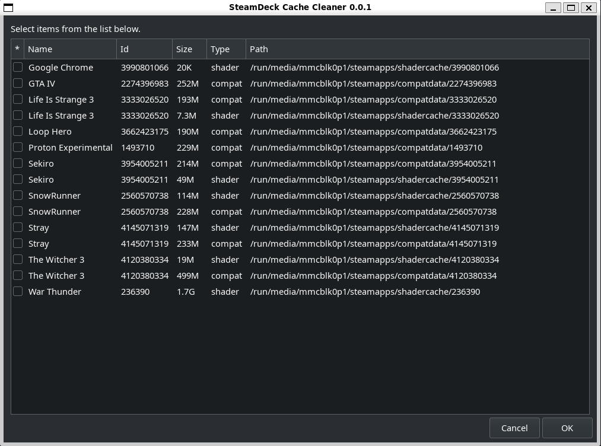
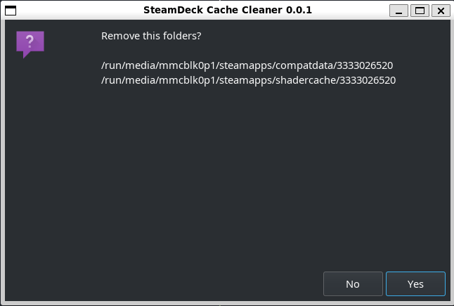

# SteamDeck

## cleaner.sh
SteamDeck Cache Cleaner script

After running script create map of installed apps and save in to local db.
Then it find folders with steamapps and show cache available to remove.

Select which folders you want delete. After than confirm you choise.

